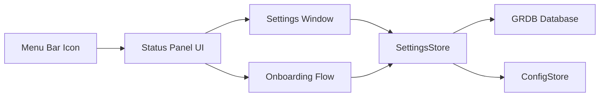

# Phase 00: Foundation

**Overview**
Establish the macOS accessory app shell, menu-bar status panel, settings/onboarding scaffolds, initial persistence, and policy scaffolds needed for later phases.

**Scope**
In scope:
- App shell and menu-bar popover
- Accessory mode (no dock icon)
- SwiftUI-first Settings and Onboarding scaffolds
- SQLite/GRDB baseline schema and config loading
- Logging policy scaffolding (opt-in transcripts only)
- Permissions checklist stubs
 - AI settings scaffolding (endpoint, API key, model selection)

Out of scope:
- Actual audio capture, STT, speaker ID, wake word
- LLM orchestration and skills execution
- Any external services integration

**Dependencies**
- SwiftUI
- AppKit status item hosting
- GRDB (SQLite)
- macOS app permissions stubs

**Design**
- App runs as accessory, menu-bar icon opens a SwiftUI status panel (arrowless NSPopover replacement).
- The UI exposes a minimal status view and Settings entry point.
- A settings model and storage layer are introduced, using GRDB for structured data and a config file for non-secret user settings.
- Logging policy is expressed in settings with no storage implementation yet.
 - Settings uses a sidebar layout with section icons and an AI tab for endpoint/key/model placeholders.
 - Onboarding auto-opens on first launch and can be re-triggered from Settings.

**Public Interfaces**
- `AppState` (global state: listening/processing/responding, settings loaded, listening toggle)
- `SettingsStore` (read/write preferences)
- `ConfigStore` (LLM endpoint, API key, and model, stored in config file)
- `Database` (GRDB wrapper)

**Implementation Steps**
1. Create the accessory app shell and menu-bar status item.
Build/Run Gate: Clean (Cmd+Shift+K), Build (Cmd+B), Run (Cmd+R).
2. Implement a SwiftUI popover view with status indicator placeholders.
Build/Run Gate: Clean (Cmd+Shift+K), Build (Cmd+B), Run (Cmd+R).
3. Add Settings window scaffold (tabs: General, Audio, Skills, Memory).
Build/Run Gate: Clean (Cmd+Shift+K), Build (Cmd+B), Run (Cmd+R).
4. Add Onboarding scaffold with placeholder steps (Welcome, Permissions, Enrollment).
Build/Run Gate: Clean (Cmd+Shift+K), Build (Cmd+B), Run (Cmd+R).
5. Add GRDB setup and migrations folder with baseline schema.
Build/Run Gate: Clean (Cmd+Shift+K), Build (Cmd+B), Run (Cmd+R).
6. Add `SettingsStore` and `ConfigStore` with read/write tests.
Build/Run Gate: Clean (Cmd+Shift+K), Build (Cmd+B), Run (Cmd+R).
7. Add logging policy setting stub with opt-in toggle.
Build/Run Gate: Clean (Cmd+Shift+K), Build (Cmd+B), Run (Cmd+R).
8. Add permissions checklist UI section with placeholders.
Build/Run Gate: Clean (Cmd+Shift+K), Build (Cmd+B), Run (Cmd+R).

**Adjustments During Implementation**
- Status UI uses an arrowless `NSPanel` instead of `NSPopover` to avoid the popover arrow.
- Settings moved to a left-sidebar layout with icons and added an AI section for endpoint/key/model placeholders.
- Permissions checklist moved under Skills (removed from Audio), with more descriptive text and a Reminders entry.
- Popover status includes a listening toggle stub (mute/unmute icon) for future skill control.
- Onboarding auto-opens on first launch and can be re-triggered from General settings.
- Xcode app test targets were removed due to host-app crashes; SettingsStore/ConfigStore tests live in the PrismCore package but are not part of the app scheme.

**Status**
Complete as of February 6, 2026.

**Tests**
- Unit: `SettingsStore` read/write (PrismCore package)
- Unit: `ConfigStore` read/write (PrismCore package)
- Integration: app launches with menu-bar icon and status panel

**Risks & Open Questions**
- Risk: Accessory mode window behavior can be inconsistent with multiple monitors. Mitigation: test on multi-display setups early.
- Risk: Settings UI layout needs to feel native. Mitigation: follow Apple HIG and adopt standard SwiftUI controls.

**Mermaid Diagram**

