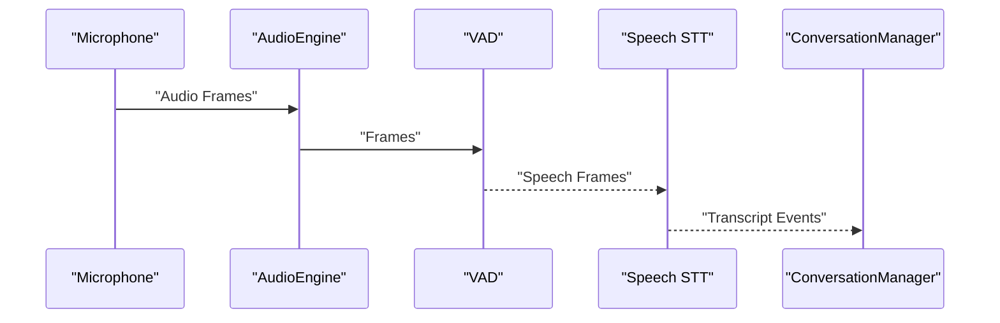

# Phase 01: Audio Capture + STT + Conversation Window

**Overview**
Implement the live audio pipeline for capture, VAD gating, streaming speech recognition, and the follow-up conversation window logic.

**Scope**
In scope:
- AVAudioEngine capture from microphone
- VAD thresholds and chunking policy
- Speech framework streaming STT
- Conversation window and closing phrase rules
- UI state updates and audio level meter

Out of scope:
- Speaker ID and wake word
- LLM orchestration and skills
- Memory agent

**Dependencies**
- AVFoundation (AVAudioEngine)
- Speech framework
- Swift concurrency
- SettingsStore for thresholds

**Design**
- Audio capture runs continuously and feeds a VAD gate to reduce STT overhead.
- STT runs on gated audio buffers; transcription results are incremental.
- Conversation window opens after a wake-word-triggered command in later phases, but in this phase it can be opened manually for testing.
- The conversation window expires 15 seconds after the last recognized utterance by the same speaker, with a max of 5 turns.
- Closing phrase detection immediately ends the window and clears context.

**Public Interfaces**
- `AudioCaptureService` (start/stop, audio buffer stream)
- `VADService` (isSpeech(buffer) -> Bool)
- `STTService` (startStreaming() -> AsyncStream<TranscriptEvent>)
- `ConversationManager` (openWindow, closeWindow, acceptUtterance)
- `TranscriptEvent` (partial, final, confidence, timestamp)

**Implementation Steps**
1. Implement `AudioCaptureService` with AVAudioEngine input tap.
Build/Run Gate: Clean (Cmd+Shift+K), Build (Cmd+B), Run (Cmd+R).
2. Implement `VADService` with configurable thresholds and frame sizing.
Build/Run Gate: Clean (Cmd+Shift+K), Build (Cmd+B), Run (Cmd+R).
3. Implement `STTService` using Speech framework live audio recognition.
Build/Run Gate: Clean (Cmd+Shift+K), Build (Cmd+B), Run (Cmd+R).
4. Wire capture -> VAD -> STT with async streams and backpressure.
Build/Run Gate: Clean (Cmd+Shift+K), Build (Cmd+B), Run (Cmd+R).
5. Implement `ConversationManager` with 15s window and 5 turn cap.
Build/Run Gate: Clean (Cmd+Shift+K), Build (Cmd+B), Run (Cmd+R).
6. Add closing phrase detection with configurable alias list.
Build/Run Gate: Clean (Cmd+Shift+K), Build (Cmd+B), Run (Cmd+R).
7. Update popover UI to show listening/processing/responding and audio meter.
Build/Run Gate: Clean (Cmd+Shift+K), Build (Cmd+B), Run (Cmd+R).

**Tests**
- Unit: VAD threshold behavior
- Unit: Conversation window expiry and turn cap
- Integration: Live audio → STT partial/final events
- Performance: audio pipeline latency under continuous input

**Risks & Open Questions**
- Risk: Speech framework may require network depending on device state. Mitigation: detect offline mode and inform user.
- Risk: False VAD positives cause extra STT load. Mitigation: tune thresholds and add adaptive smoothing.

**Mermaid Diagram**

