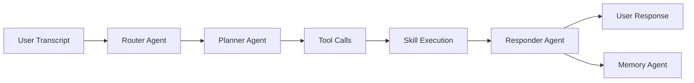

# Phase 02: LLM Orchestration + Tooling Core

**Overview**
Build the OpenAI-compatible client, streaming support, multi-agent orchestration, and the skill registry/tool schema that the LLM can call.

**Scope**
In scope:
- OpenAI-compatible HTTP client with Bearer auth
- Model discovery via `/v1/models` and manual override
- Streaming responses when supported
- 4-agent orchestration pipeline
- Tool schema definition and skill registry
- Tool gating based on settings

Out of scope:
- Real skills implementations
- Wake word and speaker ID
- Memory agent behavior beyond interface

**Dependencies**
- URLSession and async/await
- JSON encoding/decoding
- SettingsStore and ConfigStore
- Swift concurrency

**Design**
- LLM client supports both streaming and non-streaming completions.
- Multi-agent flow: Router → Planner → Responder → Memory.
- Skill registry exposes tool schemas only for enabled skills.
- Tool execution is separated from tool selection.
- Timeouts and retry logic protect the pipeline.

**Public Interfaces**
- `LLMClient` (listModels, complete, streamComplete)
- `LLMRequest` (messages, tools, temperature, maxTokens)
- `LLMEvent` (token, toolCall, done, error)
- `Agent` protocol (run(input) async throws -> output)
- `Skill` protocol (id, metadata, toolSchema, execute)
- `SkillRegistry` (enabled skills, tool exports)

**Implementation Steps**
1. Implement `LLMClient` with Bearer auth and endpoint configuration.
Build/Run Gate: Clean (Cmd+Shift+K), Build (Cmd+B), Run (Cmd+R).
2. Add model discovery via `/v1/models` and a manual override list.
Build/Run Gate: Clean (Cmd+Shift+K), Build (Cmd+B), Run (Cmd+R).
3. Implement streaming response handling and fallback to non-streaming.
Build/Run Gate: Clean (Cmd+Shift+K), Build (Cmd+B), Run (Cmd+R).
4. Define tool schema types and the `Skill` protocol.
Build/Run Gate: Clean (Cmd+Shift+K), Build (Cmd+B), Run (Cmd+R).
5. Implement `SkillRegistry` with enable/disable and permission gating.
Build/Run Gate: Clean (Cmd+Shift+K), Build (Cmd+B), Run (Cmd+R).
6. Implement agent contracts and the 4-agent pipeline.
Build/Run Gate: Clean (Cmd+Shift+K), Build (Cmd+B), Run (Cmd+R).
7. Implement error handling, timeouts, and fallback responses.
Build/Run Gate: Clean (Cmd+Shift+K), Build (Cmd+B), Run (Cmd+R).

**Tests**
- Unit: JSON encoding/decoding for LLM requests
- Unit: Skill registry gating rules
- Integration: streaming event parsing
- Integration: agent pipeline with mock LLM

**Risks & Open Questions**
- Risk: OpenAI-compatible servers differ in streaming format. Mitigation: support common variants and strict parsing fallback.
- Risk: Tool schema drift across versions. Mitigation: version tool definitions and validate schema.

**Mermaid Diagram**

