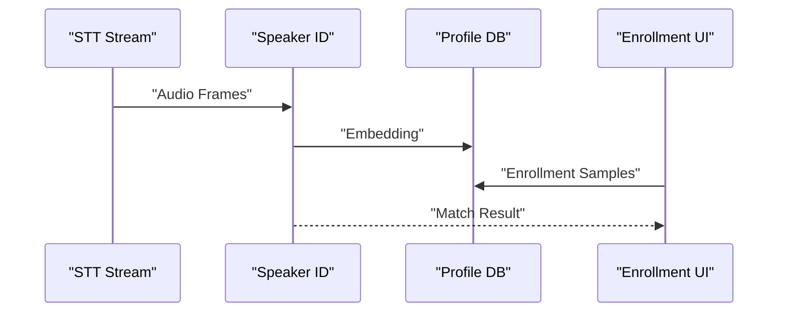

# Phase 03: Speaker ID + Enrollment + Memory

**Overview**
Integrate on-device speaker identification using Core ML embeddings, implement enrollment, and add a memory agent with a view/edit UI.

**Scope**
In scope:
- Core ML speaker embedding model integration
- Enrollment flow (10 scripted + 5 free, fixed prompts)
- Speaker matching thresholds and unknown speaker UX
- Memory agent lifecycle (post-session)
- Memory UI (view/edit)

Out of scope:
- Wake word model training
- Skills beyond interface integration
- Audio output and TTS

**Dependencies**
- Core ML runtime
- GRDB for user profiles and memory
- SwiftUI for enrollment and memory UI
- SettingsStore for thresholds and toggles

**Design**
- Speaker ID runs on the same audio stream as STT, in parallel.
- Enrollment stores embeddings per user; matching uses cosine similarity and a configurable threshold.
- Unknown speakers are prompted to identify or enroll.
- Memory agent runs after session close, summarizes, and updates per-user memory entries.
- Memory UI allows view and edit of stored memory items.

**Public Interfaces**
- `SpeakerIDService` (extractEmbedding, match)
- `SpeakerProfile` (userId, embeddings, threshold)
- `EnrollmentSession` (progress, promptIndex, result)
- `MemoryAgent` (summarizeSession, updateProfile)
- `MemoryStore` (CRUD for memory entries)

**Implementation Steps**
1. Integrate Core ML model loading and embedding extraction.
Build/Run Gate: Clean (Cmd+Shift+K), Build (Cmd+B), Run (Cmd+R).
2. Implement enrollment flow with fixed prompts and sample capture.
Build/Run Gate: Clean (Cmd+Shift+K), Build (Cmd+B), Run (Cmd+R).
3. Store embeddings in GRDB with per-user profiles.
Build/Run Gate: Clean (Cmd+Shift+K), Build (Cmd+B), Run (Cmd+R).
4. Implement matching with cosine similarity and threshold configuration.
Build/Run Gate: Clean (Cmd+Shift+K), Build (Cmd+B), Run (Cmd+R).
5. Implement unknown speaker prompt and selection UI.
Build/Run Gate: Clean (Cmd+Shift+K), Build (Cmd+B), Run (Cmd+R).
6. Implement Memory agent and storage schema.
Build/Run Gate: Clean (Cmd+Shift+K), Build (Cmd+B), Run (Cmd+R).
7. Implement Memory view/edit UI in Settings.
Build/Run Gate: Clean (Cmd+Shift+K), Build (Cmd+B), Run (Cmd+R).

**Tests**
- Unit: cosine similarity and threshold boundaries
- Unit: enrollment flow completion rules
- Integration: speaker match accuracy with sample inputs
- Integration: memory agent writes and UI reads

**Risks & Open Questions**
- Risk: Model accuracy depends on enrollment quality. Mitigation: enforce prompt variety and allow re-enrollment.
- Risk: Memory agent may store sensitive info. Mitigation: allow opt-out and manual edits.

**Mermaid Diagram**

