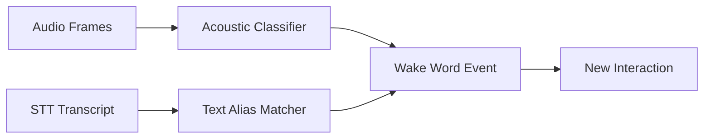

# Phase 04: Wake Word Hybrid

**Overview**
Implement hybrid wake-word detection using an acoustic classifier and a text-based fallback that handles transcription variants.

**Scope**
In scope:
- SoundAnalysis streaming classifier integration
- Bundled Create ML sound classifier model
- In-app sensitivity calibration for thresholds
- Text fallback with alias list and normalization

Out of scope:
- In-app model training
- TTS responses
- Additional skills

**Dependencies**
- SoundAnalysis framework
- Core ML model bundle
- SettingsStore for sensitivity and aliases

**Design**
- Acoustic detector runs continuously on audio frames and emits wake-word hits.
- Text fallback checks STT output for configurable aliases and variants.
- Either signal can open a new interaction and clears prior follow-up context.
- Calibration adjusts thresholds per environment without retraining the model.

**Public Interfaces**
- `WakeWordService` (start, stop, onDetect)
- `WakeWordConfig` (aliases, sensitivity, minConfidence)
- `WakeWordEvent` (source, confidence, timestamp)

**Implementation Steps**
1. Integrate SoundAnalysis streaming classifier pipeline.
Build/Run Gate: Clean (Cmd+Shift+K), Build (Cmd+B), Run (Cmd+R).
2. Bundle the Create ML classifier model and wire inference.
Build/Run Gate: Clean (Cmd+Shift+K), Build (Cmd+B), Run (Cmd+R).
3. Implement calibration UI to tune sensitivity and confidence thresholds.
Build/Run Gate: Clean (Cmd+Shift+K), Build (Cmd+B), Run (Cmd+R).
4. Implement text fallback with alias list and normalization rules.
Build/Run Gate: Clean (Cmd+Shift+K), Build (Cmd+B), Run (Cmd+R).
5. Implement wake-word event emission and pipeline integration.
Build/Run Gate: Clean (Cmd+Shift+K), Build (Cmd+B), Run (Cmd+R).

**Tests**
- Unit: alias normalization rules
- Unit: calibration threshold bounds
- Integration: acoustic hits trigger session start
- Integration: text fallback triggers session start

**Risks & Open Questions**
- Risk: Acoustic model false positives in noisy rooms. Mitigation: expose sensitivity and provide room-specific presets.
- Risk: Text fallback triggers on unrelated words. Mitigation: require proximity to verbs or commands in parsing.

**Mermaid Diagram**

