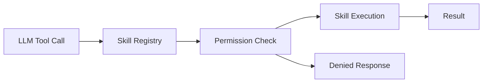

# Phase 05: Skills MVP

**Overview**
Implement the first three skills (WeatherKit, MusicKit, Reminders) and wire permission gating into onboarding and settings.

**Scope**
In scope:
- WeatherKit skill with location permissions, current + minute + daily datasets
- MusicKit skill with Apple Music authorization and playback commands (ApplicationMusicPlayer)
- Reminders skill with EventKit authorization and CRUD
- Skill enable/disable and permission gating with status rows
- AirPlay route picker in onboarding, settings, and popover
- Speech-driven destructive confirmation (remove from playlist only)

Out of scope:
- HomeKit, Calendar, Messages, Shortcuts
- External plugin system

**Dependencies**
- WeatherKit
- CoreLocation (location permission)
- MusicKit
- EventKit (Reminders)
- SkillRegistry

**Design**
- Each skill is implemented behind the `Skill` protocol with a clear tool schema.
- Tool schemas are strict JSON with enumerated actions.
- Skills are only exposed to the LLM when enabled and when permission is granted.
- Skill execution returns a natural-language summary string for the LLM, plus structured data.
- Destructive actions (remove from playlist) require confirmation via conversation flow.

**Public Interfaces**
- `WeatherSkill` (current, minute, daily; free-form location)
- `MusicSkill` (play, pause, resume, skip, shuffle, addToPlaylist)
- `RemindersSkill` (create, update, remove, list, complete)
- `PermissionManager` (request, status, explanations)
- `SkillResult`/`ToolResult` (status, summary, data, errors)
- `PendingConfirmation` (destructive confirmation state)

**Implementation Steps**
1. Implement `PermissionManager` and wire toggles in onboarding and Settings > Skills (with status rows).
Build/Run Gate: Clean (Cmd+Shift+K), Build (Cmd+B), Run (Cmd+R).
2. Implement WeatherKit skill with location permission, current + minute + daily datasets, and free-form geocoding.
   - Add units setting (system default + override) and Weather attribution in Settings footer.
Build/Run Gate: Clean (Cmd+Shift+K), Build (Cmd+B), Run (Cmd+R).
3. Implement MusicKit skill with authorization and ApplicationMusicPlayer playback.
   - Library-first search, fallback to catalog.
   - Add AirPlay route picker in onboarding, Settings > Audio, and popover.
Build/Run Gate: Clean (Cmd+Shift+K), Build (Cmd+B), Run (Cmd+R).
4. Implement Reminders skill with EventKit authorization and CRUD.
   - Require list name or prompt for clarification (no default list).
Build/Run Gate: Clean (Cmd+Shift+K), Build (Cmd+B), Run (Cmd+R).
5. Implement destructive confirmation flow for remove-from-playlist only.
Build/Run Gate: Clean (Cmd+Shift+K), Build (Cmd+B), Run (Cmd+R).
6. Ensure skill registry exposes only enabled and authorized skills.
   - Log skill inputs/outputs in Xcode debug log.
Build/Run Gate: Clean (Cmd+Shift+K), Build (Cmd+B), Run (Cmd+R).

**Tests**
- Unit: skill gating by permission
- Integration: WeatherKit request with location permission
- Integration: MusicKit authorization and playback
- Integration: Reminders CRUD in selected list with clarification prompts
- UX: confirmation prompts for destructive actions (remove from playlist only)
- UX: AirPlay route picker placement (onboarding + settings + popover)

**Risks & Open Questions**
- Risk: Permission prompts can be confusing. Mitigation: add concise explanations in onboarding.
- Risk: Apple Music subscription differences. Mitigation: detect availability and show fallback messaging.
- Risk: AirPlay routing cannot be set programmatically. Mitigation: expose route picker and explain user control.

**Mermaid Diagram**

