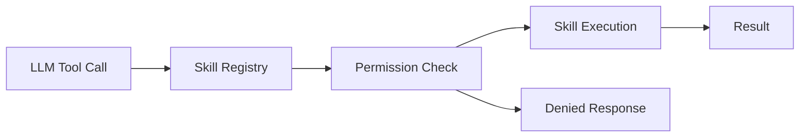

# Phase 05: Skills MVP

**Overview**
Implement the first three skills (WeatherKit, MusicKit, Reminders) and wire permission gating into onboarding and settings.

**Scope**
In scope:
- WeatherKit skill with location permissions
- MusicKit skill with Apple Music authorization and playback commands
- Reminders skill with EventKit authorization and CRUD
- Skill enable/disable and permission gating

Out of scope:
- HomeKit, Calendar, Messages, Shortcuts
- External plugin system

**Dependencies**
- WeatherKit
- CoreLocation (location permission)
- MusicKit
- EventKit (Reminders)
- SkillRegistry

**Design**
- Each skill is implemented behind the `Skill` protocol with a clear tool schema.
- Skills are only exposed to the LLM when enabled and when permission is granted.
- Destructive actions (delete/remove) require confirmation.

**Public Interfaces**
- `WeatherSkill` (forecast, current conditions)
- `MusicSkill` (play, pause, addToPlaylist, shuffle)
- `RemindersSkill` (create, update, remove, list)
- `PermissionManager` (request, status)

**Implementation Steps**
1. Implement `PermissionManager` and wire toggles in onboarding/settings.
Build/Run Gate: Clean (Cmd+Shift+K), Build (Cmd+B), Run (Cmd+R).
2. Implement WeatherKit skill with location permission and basic forecast.
Build/Run Gate: Clean (Cmd+Shift+K), Build (Cmd+B), Run (Cmd+R).
3. Implement MusicKit skill with authorization and playback.
Build/Run Gate: Clean (Cmd+Shift+K), Build (Cmd+B), Run (Cmd+R).
4. Implement Reminders skill with EventKit authorization and CRUD.
Build/Run Gate: Clean (Cmd+Shift+K), Build (Cmd+B), Run (Cmd+R).
5. Implement destructive-action confirmation flow.
Build/Run Gate: Clean (Cmd+Shift+K), Build (Cmd+B), Run (Cmd+R).
6. Ensure skill registry exposes only enabled and authorized skills.
Build/Run Gate: Clean (Cmd+Shift+K), Build (Cmd+B), Run (Cmd+R).

**Tests**
- Unit: skill gating by permission
- Integration: WeatherKit request with location permission
- Integration: MusicKit authorization and playback
- Integration: Reminders CRUD in selected list
- UX: confirmation prompts for destructive actions

**Risks & Open Questions**
- Risk: Permission prompts can be confusing. Mitigation: add concise explanations in onboarding.
- Risk: Apple Music subscription differences. Mitigation: detect availability and show fallback messaging.

**Mermaid Diagram**

