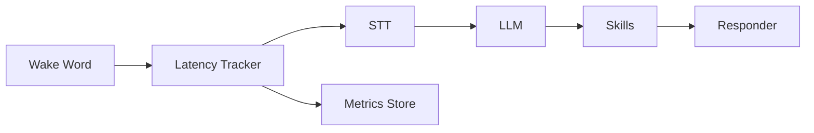

# Phase 06: Performance + Reliability

**Overview**
Meet the latency target (<1.5s to first response) and harden the pipeline for continuous 24x7 operation.

**Scope**
In scope:
- Latency instrumentation and measurement
- Parallel pipeline execution and backpressure control
- Timeouts and failure handling
- Profiling and stability practices

Out of scope:
- New product features
- TTS output and audio playback

**Dependencies**
- Swift concurrency
- Instruments and signposts
- Existing pipeline components

**Design**
- Measure from wake-word detection to first response token.
- Parallelize STT and speaker ID without blocking tool execution.
- Add backpressure to avoid memory buildup during continuous input.
- Failures should degrade gracefully to a short, friendly response.

**Public Interfaces**
- `LatencyTracker` (mark, measure, report)
- `PipelineSupervisor` (timeouts, retries, cancellation)
- `BackpressureController` (buffer size limits)

**Implementation Steps**
1. Add latency signposts around wake-word, STT, LLM, and response.
Build/Run Gate: Clean (Cmd+Shift+K), Build (Cmd+B), Run (Cmd+R).
2. Implement parallel execution strategy and cancellation rules.
Build/Run Gate: Clean (Cmd+Shift+K), Build (Cmd+B), Run (Cmd+R).
3. Add backpressure control to audio and transcript queues.
Build/Run Gate: Clean (Cmd+Shift+K), Build (Cmd+B), Run (Cmd+R).
4. Add timeout and retry rules for LLM and skills.
Build/Run Gate: Clean (Cmd+Shift+K), Build (Cmd+B), Run (Cmd+R).
5. Implement crash resilience patterns and clean shutdown.
Build/Run Gate: Clean (Cmd+Shift+K), Build (Cmd+B), Run (Cmd+R).

**Tests**
- Performance: latency budget check under continuous use
- Stress: prolonged idle listening
- Failure: LLM timeout and skill failure handling

**Risks & Open Questions**
- Risk: Low-latency target may constrain model size. Mitigation: provide model recommendations in settings.
- Risk: Continuous audio capture may cause memory drift. Mitigation: periodic restart of audio engine.

**Mermaid Diagram**

